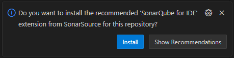

Ignores all files in .vscode/ except extensions.json, which helps share recommended extensions without syncing personal settings :

**.gitignore**
```plaintext
.vscode/*
!.vscode/extensions.json
```

This extensions.json file tells VS Code to recommend installing the SonarQube for IDE extension (SonarSource.sonarlint-vscode) when someone opens the project. It's useful for promoting consistent code quality tools across your team.

**.vscode/extensions.json**
```json
{
  "recommendations": [
    "SonarSource.sonarlint-vscode"
  ]
}
```


